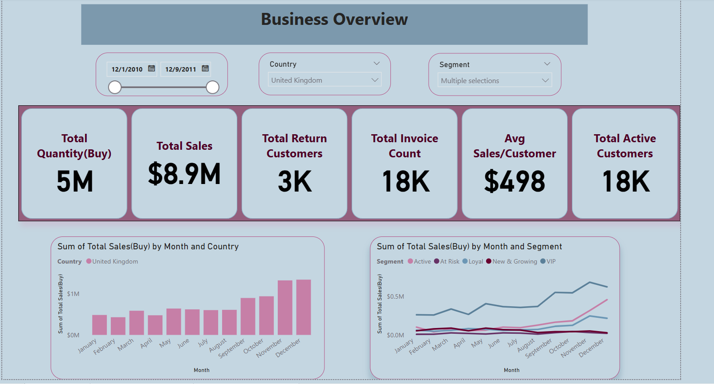

# ecommerce-rfmt
Customer segmentation project using RFMT modeling, DuckDB SQL, and Power BI. Demonstrates full analytics lifecycle: data cleaning, KPI development, and dashboard creation for business insights and stakeholder reporting.


## **Project Goal**

To analyze one year of ecommerce transactions (\~400K rows, \~4,000 customers) and deliver **customer segmentation** and **business performance insights** through an interactive Power BI dashboard.

This project demonstrates how I:

* Clean and model raw data
* Apply **RFMT segmentation**
* Build dimensional tables using SQL
* Translate findings into visual business stories

---

## **Business Objectives**

* Identify and track **high-value (VIP) customers**
* Monitor **return and fraud behavior**
* Understand **customer lifecycle** and purchasing patterns
* Visualize **key business KPIs** (sales, quantity, AOV, etc.)
* Support **marketing targeting** via customer segments

---

## **Skills & Tools Used**

| Tool              | Purpose                             |
| ----------------- | ----------------------------------- |
| **Python**        | Data wrangling, feature engineering |
| **DuckDB SQL**    | Dimensional modeling, KPI queries   |
| **Power BI**      | Dashboard design, data storytelling |
| **Colab + Drive** | Cloud-based workflow                |

---

## **Project Directory**

```bash
ecommerce-rfmt/
├── rfmt_analysis.ipynb            # Data cleaning, feature creation, RFMT scoring
├── ecommerce_rfmt_dashboard.pbix  # Final Power BI report
├── Screenshot of Powerbi.PNG      # Dashboard preview
├── daily_summary.csv              # Output for dashboard upload
├── return_analysis.csv            # Return behavior summary
├── README.md                      # Project documentation
```

---

## **Dashboard Preview**



